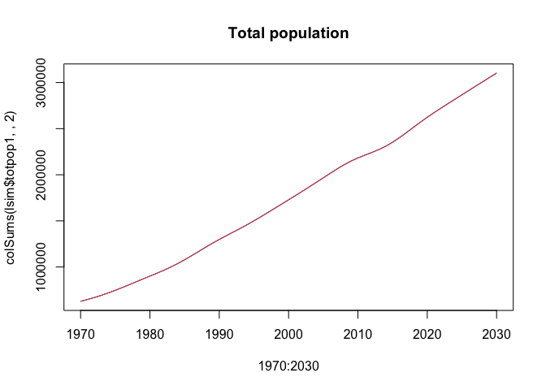
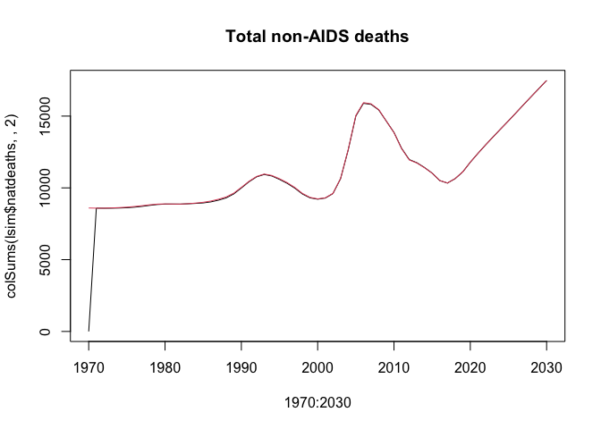
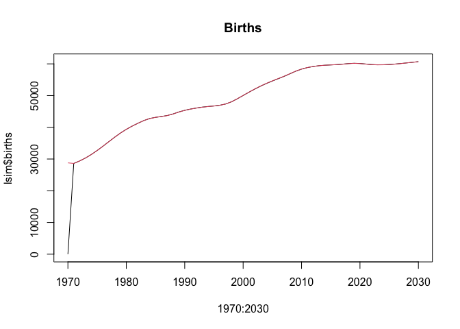

<!-- README.md is generated from README.Rmd. Please edit that file -->

# leapfrog

<!-- badges: start -->

[](https://github.com/mrc-ide/leapfrog/actions)
[](https://codecov.io/gh/mrc-ide/leapfrog?branch=demproj-only)
<!-- badges: end -->

Leapfrog is a multistate population projection model for demographic and
HIV epidemic estimation.

The name *leapfrog* is in honor of
[Professor](https://blogs.lshtm.ac.uk/alumni/2018/07/16/obituary-professor-basia-zaba/)
Basia
[Zaba](https://translate.google.co.uk/#view=home&op=translate&sl=pl&tl=en&text=%C5%BBaba).

*Note: the CCMPP model and implementation of Bayesian Population
Reconstruction in TMB previously here have moved to a separate
repository: <https://www.github.com/mrc-ide/ccmpp.tmb>*

## Branch *demproj-only*

The branch *demproj-only* contains code for only the demographic
projection model as a simpler example for developing interfaces with
fewer input and output arrays.

## Simulation model

The simulation model is implemented in a header-only C++ library located
in [`inst/include/leapfrog-raw.h`](inst/include/leapfrog-raw.h). This
location allows the C++ code to be imported in other R packages via
specifying `LinkingTo: leapfrog` in the `DESCRIPTION` file.

The simulation model is callable in R via a wrapper function
`leafrogR()` created with [Rcpp](https://www.rcpp.org).

## Installation

Install the development version from
[GitHub](https://github.com/mrc-ide/leapfrog/tree/demproj-only) via
devtools:

``` r
# install.packages("devtools")
devtools::install_github("mrc-ide/leapfrog@demproj-only")
```

## Example

The file `bwa_demproj-only_spectrum-v6.13_2022-02-12.PJNZ` contains an
example Spectrum file constructed from default country data for Botswana
in Spectrum v2.13 (December 2021) with *only DemProj* activated.

Prepare model inputs.

``` r
library(leapfrog)
pkgbuild::compile_dll(".", debug = FALSE)
devtools::load_all(".")
#> ℹ Loading leapfrog

pjnz <- "tests/testdata/spectrum/v6.13/bwa_demproj-only_spectrum-v6.13_2022-02-12.PJNZ"

demp <- prepare_leapfrog_demp(pjnz)
```

Simulate ‘full’ age group (single-year age) and ‘coarse’ age group
(collapsed age groups) models.

``` r
lsim <- leapfrogR(demp)
```

Compare population, deaths, and births to Spectrum outputs. The
*leapfrog* model does not produce birth or death outputs for the
baseline year.

``` r
specres <- eppasm::read_hivproj_output(pjnz)

plot(1970:2030, colSums(lsim$totpop1,,2), type = "l", main = "Total population")
lines(1970:2030, colSums(specres$totpop,,2), col = 2)
```



``` r
plot(1970:2030, colSums(lsim$natdeaths,,2), type = "l", main = "Total non-AIDS deaths")
lines(1970:2030, colSums(specres$natdeaths,,2), col = 2)
```



``` r
plot(1970:2030, lsim$births, type = "l", main = "Births")
lines(1970:2030, specres$births, col = 2)
```



## Code design

### Simulation model

The simulation model is implemented as templated C++ code in
`inst/include/leapfrog-raw.h`. This is the simulation model may be
developed as a standalone C++ library that can be called by other
software without requiring R-specific code features. The code uses
header-only open source libraries to maximize portability.

### R functions

The file `src/leapfrogR.cpp` contains R wrapper functions for the model
simulation via [Rcpp](http://dirk.eddelbuettel.com/code/rcpp.html) and
[RcppEigen](http://dirk.eddelbuettel.com/code/rcpp.eigen.html).

## Development notes

### Simulation model

-   The model was implemented using *Eigen::Tensor* containers. These
    were preferred for several reasons:

    -   Benchmarking found they were slighlty more efficient than
        *boost::multi_array*.
    -   Column-major indexing in the same order as R
    -   Other statistical packages (e.g. TMB, Stan) rely heavily on
        *Eigen* so using *Eigen* containers slims the dependencies.
